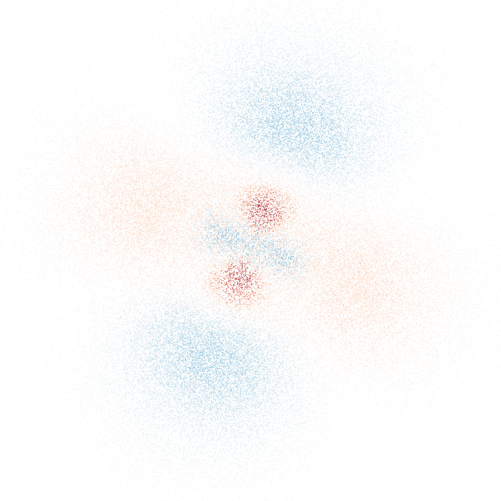

<div align="center">



# Project Evanescence

*An exploration in the visualization of hydrogenic orbitals.*

</div>

The web interface is hosted [here](https://al2me6.github.io/evanescence).

Continuous benchmarks can be viewed [here](https://al2me6.github.io/evanescence/dev/bench).

## Features

This project is a work-in-progress. Currently, the following features are implemented:

* Computation of arbitrary real and complex hydrogen orbitals (up to *n* = 8 exposed)
* Computation of arbitrary linear combinations of real orbitals (a common selection exposed)
* A variant of the "pointillist" visualization presented in [Tully et al. 2013](https://doi.org/10.1021/ed300393s)
* Plotting of nodal surfaces
* Plotting of wavefunction cross-sections
* Plotting of radial wavefunction and probability density values
* Plotting of 3D isosurfaces

## CLI

The CLI can be used to generate plots for preview/debugging purposes. Do note that it uses the [`plotly` Python library](https://pypi.org/project/plotly/) and [`pyo3`](https://crates.io/crates/pyo3) for plotting, meaning that a recent version of Python 3 and its development headers need to be installed.

```terminal
$ cargo run -- --help
Usage: evanescence_cli <n> <l> <m> [-m <mode>] [-q <quality>] [--skip-render] [--dump-computation]

Simple CLI for evanescence_core, using the Plotly Python library for plotting.
Note: pass two dashes before arguments for negative values: `evanescence_cli -- 4 2 -1`.

Options:
  -m, --mode        select the visualization computed: Pointillist (default),
                    PointillistWithNodes, PointillistComplex, Radial,
                    RadialProbabilityDistribution, CrossSectionXY,
                    CrossSectionYZ, CrossSectionZX,
  -q, --quality     render quality: Minimum, Low, Medium, High (default),
                    VeryHigh, or Extreme
  --skip-render     skip rendering (effectively a benchmark for computation
                    speed)
  --dump-computation
                    dump computation result to console
  --help            display usage information
```

For example, to render an xy-plane cross section of the 4d<sub>xy</sub> orbital at VeryHigh quality, run:

```terminal
$ cargo run --release -- -q VeryHigh -m CrossSectionXY -- 4 2 -2
Rendering CrossSectionXY visualization for real orbital 4,2,-2 at VeryHigh quality...
Computed 24964 points in 0.002s.
Rendered in 0.868s.
```

## License

This project is released under the GNU Affero GPL license, version 3.
